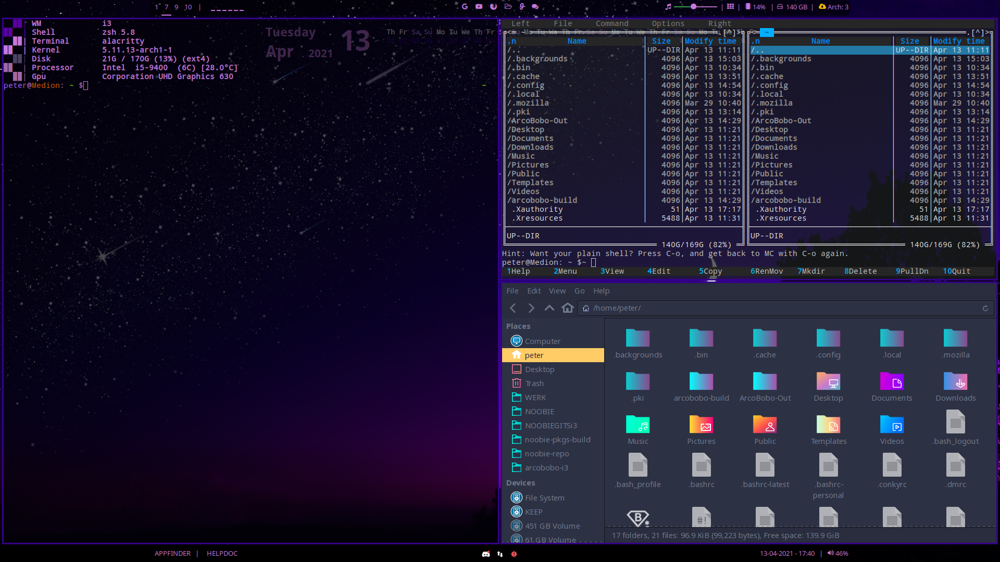

# Product Name
> This is a ArcoBobo-i3 but...


I changed the location of backgrounds to .backgrounds
There is a .icons or .themes possible but not a .backgrounds - illogical!!!!



## Why this adaptation

Because i can. And i wanted to build a distribution with what i like.


## Building

You can build it yourself with the scripts in arcobobo-i3-wallpaper-zsh.

```sh
installationscripts/30-build-the-iso-the-first-time.sh
```
## Download

https://peterdauwe.github.io/

